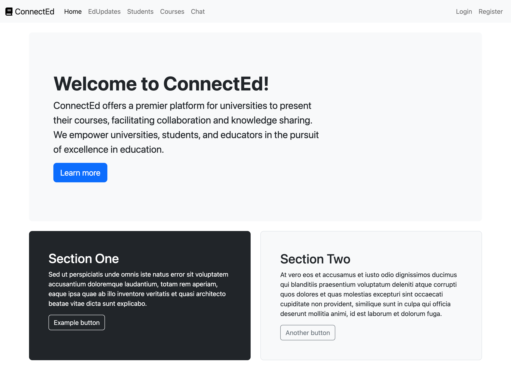

ConnectEd
=========

ConnectEd offers a premier platform for universities to present their courses,
facilitating collaboration and knowledge sharing. We empower universities,
students, and educators in the pursuit of excellence in education.

Installation
------------

To install ConnectEd:

1. Install [Conda](https://docs.conda.io/projects/conda/en/latest/user-guide/install/).

2. On a command prompt or terminal with your ConnectEd projects's directory as
   the current working directory, run the following commands:

   a. Create and activate an environment:

       conda create --name ConnectEd
       conda activate ConnectEd

   b. Install pip:

       pip install pip

   c. Install Django:

       pip install django

   d. Install django-bootstrap5:

       pip install django-bootstrap5

   e. Install Django REST framework:

       pip install djangorestframework

Usage
-----

To use ConnectEd:

1. On a command prompt or terminal with your ConnectEd projects's directory as
   the current working directory, run the following commands:

   a. Initialize the database and apply the initial migrations:

       python manage.py makemigrations
       python manage.py migrate

   b. Load the initial fixtures:

       python manage.py loaddata roles
       python manage.py loaddata users
       python manage.py loaddata statuses
       python manage.py loaddata courses
       python manage.py loaddata feedbacks

   c. Start the development server:

       python manage.py runserver

To test ConnectEd:

1. On a command prompt or terminal with your ConnectEd projects's directory as
   the current working directory, run the following command:

       python manage.py test
